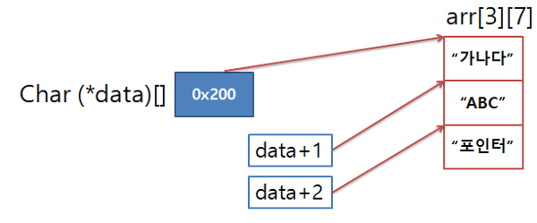

# Week 9: pointer

## **Overview**
Welcome to Week 8 of C programming! This week, we will explore pointer. By the end of this tutorial, you will:
- Understand the basic concept of pointer
- Understand the difference between pointer to an array and pointer array (배열 포인터 vs 포인터 배열)
- Understand the double pointer

### **Time Breakdown**
- **Introduction to a function**
- **Call by Value, Call by reference**
- **Recursion Fuction**
- **Exercises & Q/A**

---

## **1. Pointer **
Pointer is a variable that stores the "memory address".  
*: Dereference operator  
&: Address-of operator  
%p: Format specifier for printing adresses  
### **Example:** How to define and use functions
```c
int a = 10;
int *p = &a;

printf("value of a: %d\n", a);
printf("address of a: %p\n", &a);
printf("value of p: %p\n", p);
printf("value of *p: %d\n", *p);

```
### **Example Output:**
```
value of a: 10
address of a: 0x7ffee45c489c
value of p: 0x7ffee45c489c
value of *p: 10
```

---

## **2. Pointer to an array vs Pointer array **
Pointer to an array (배열 포인터) : It is a singular pointer that points to a certain type of "array".  
-It is usually used when the parameter is 2-dimensional array.  

Pointer array (포인터 배열) : An array that holds pointers as its elements.  

### **Example:** Change numbers in the functions
```c
#include <stdio.h>

int main() {
  // Pointer to an array
    int arr[3] = { 10, 20, 30 };
    int (*p)[3] = &arr;  // 3개의 int로 이루어진 배열의 주소를 저장

    for (int i = 0; i < 3; i++) {
        printf("(*p)[%d]: %d\n", i, (*p)[i]);
    }

   // Pointer array
    int a = 10, b = 20, c = 30;
    int *arr2[3] = { &a, &b, &c }; 
    for (int i = 0; i < 3; i++) {
        printf("value of *arr[%d]: %d\n", i, *arr2[i]);
    }


    return 0;
}

```
  


  


### **Example Output:**
```
(*p)[0]: 10
(*p)[1]: 20
(*p)[2]: 30
value of *arr[0]: 10
value of *arr[1]: 20
value of *arr[2]: 30
```

---

## **3. Double Pointer **
Double pointer is a variable that stores the "memory address of pointer".

### **Example:** calculate the sum from 0 to n
```c
void modify(int **double_ptr) {
    **double_ptr = 999;
}

int main() {
    int x = 10;
    int *p = &x;
    modify(&p);
    printf("value of x: %d\n", x);
}


```
### **Example Output:**
```
value of x: 999
```


---

### **Exercise 1:** Make a swap function.
1. Input two numbers
2. change the value of each variable
3. print the result 
### **Example Output **
```
Please enter two numbers: 1 2
Before swap num: num1 = 1, num2 = 2
After swap num: num1 = 2, num2 = 1
```

### **Exercise 2: Make a program hadling 1-dimension matrix (array) ** 

You need to write these functinos:

- void set_matrix(int ary[], int len);  
-set the matrix in ascending order from 0 to len

- void reverse_matrix(int ary[], int len);  
-Reverse the order of the array  

- void print_matrix(int ary[], int len);  
-Print out all numbers in the array  

Hint* 
1. Size of ary varies everytime. Use a sizeof() function to get a length of array
2. Array is handled in the way of Call By Reference. You don't need to care about pointer!

### **Example Output (for `n = 9`):**
```
===== After set_matrix function =====
Matrix: 0 1 2 3 4 5 6 7 8 
===== After reverse_matrix function =====
Matrix: 8 7 6 5 4 3 2 1 0 
```

### **Exercise 3:** Write a program that calculate the Factorial using recursive function and for/while loop.**
You need to make 2 functions to calculate the fatorial of input number. One uses recursive function and the other one uses for or while loop.

### **Example Output **

```
Please enter a number: 5
Factorial of 5 using recursive function is 120
Factorial of 5 using for loop is 120
```

---

## **Bonus Challenge: Make a program that check if the string is palindrome or not (회문)**

Input could be entered both in lowercase and uppercase.

### **Example Output **
```
Please enter a string: Kayak
It is a palindrome!

Please enter a string: superman
It is not a palindrome

Please enter a string: exex
It is not a palindrome!

```

## **Bonus Challenge: Tower of Hanoi**
If you are interested in the recursive function, solve this problem!

Korean ver.
https://www.acmicpc.net/problem/11729

Englih ver.
https://leetcode.com/discuss/post/5272714/tower-of-hanoi-by-satvikmpatil-owd6/

---

## **Summary & Wrap-Up**
This week, we covered:
- Basic rules of functinos
- Defference between call by value and call by reference
- Recursive Function

### **Next Week:** 

Happy coding! 🚀
